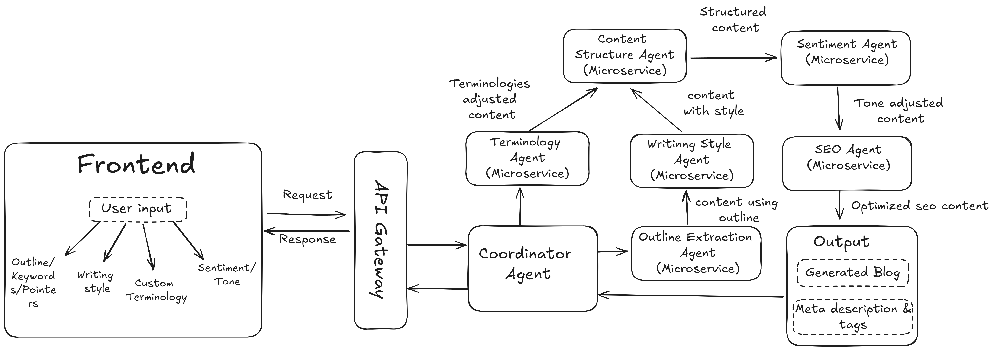

# AI-Powered Blog Generator System

## Problem Statement:

Content creators and businesses struggle to consistently produce high-quality,
on-brand blog posts that incorporate industry-specific terminology and maintain a
desired writing style. This challenge leads to inconsistent output, time-consuming
editing processes, and difficulty scaling content production.

## Team Member
- **Sanchit Baweja**

## Technologies Used

- **Python**: 
- **FastAPI**: Backend 
- **Streamlit**: Frontend 
- **Docker**: Containerization 
- **CrewAI**:  framework for orchestrating role-playing, autonomous AI agents
- **Huggingface Library**: Provides pre-trained AI models for various natural language processing tasks.

## Features of the Proposed System Design

- **Scalability**
- **Microservices Architecture**: Each AI component (agent) is a microservice
- **Modularity**: Easily add, modify, or replace AI agents without impacting the overall system's functionality.

## System Design

## Workflow Example

### 1. Input Submission
Provides the outline, selects preferences (style, terminology, sentiment)

### 2. Outline Extraction Agent
Extracts the outline and converts it to JSON format.

### 3. Writing Style Agent
Generates initial content based on the extracted outline and the selected writing style.

### 4. Terminology Agent
Integrates industry-specific terms into the generated content.

### 5. Content Structure Agent
Applies the selected content template to structure the blog.

### 6. SEO Optimization Agent
Optimizes the content for SEO by adding keywords, meta tags, and title tags.

### 7. Tone and Sentiment Analysis Agent
Analyzes and adjusts the tone and sentiment to match user preferences.

### 8. Coordinator Agent
Manages the flow, ensures agents communicate effectively, and compiles the final content.

## Data Flow

1. **User Request**: The user submits a blog outline and customization preferences via the user interface.
2. **API Gateway**: The request is routed to the `Coordinator Agent`.
3. **Coordinator Agent**: Orchestrates the workflow by dispatching tasks to various AI agents in the required order.
    - **Outline Extraction Agent**: Processes the outline and converts it into a structured JSON format.
    - **Writing Style Agent**: Generates content based on the selected writing style.
    - **Terminology Agent**: Integrates user-specific terminology into the content.
    - **Content Structure Agent**: Applies the desired template to the content.
    - **SEO Optimization Agent**: Optimizes the content for search engine optimization (SEO).
    - **Tone and Sentiment Analysis Agent**: Ensures that the tone and sentiment align with user preferences.
4. **Result Compilation**: The `Coordinator Agent` compiles the final output 
5. **Response**: The final blog content is sent back to the user via the API Gateway and displayed on the UI.

## User Interface

Here are some screenshots of the user interface:

## Links

**Deployed Frontend:** Check out the live application here. [Access Deployed App](https://bloggenerator0ai.streamlit.app/)

## License

This project is licensed under the MIT License - see the [LICENSE](LICENSE) file for details.
